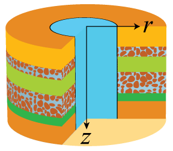
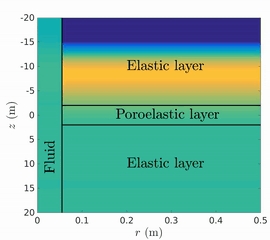
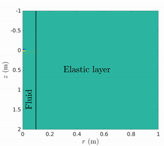

# FDModBiotCyl.jl
A Julia implementation of 2.5-D seismic wave simulation using a finite-difference method in a cylindrical coordinate system

## Overview
FDModBiotCyl.jl simulates seismic wavefield by solving Biot dynamic poroelasticity equations using a staggered-grid finite-difference method. It assumes azimuthally symmetric wavefields in a cylindrical coordinate system.

Particular emphasis is on wave simulation involving a test hole in rocks and soils (_Borehole Geophysics_). Critical remarks are:
 - Hydrophone vertical seismic profiles: Waves in a borehole due to a plane wave incidence
 - Borehole acoustics: Waves in a borehole due to a seismic source in the borehole
 - Useful to simulate waves in any materials with azimuthal symmetry (boreholes, cylinders, and pipes)
 - Acoustic, Elastic, and Poroelastic wavefields



  

This package is developed associated with research on hydrophone vertical seismic profiling ([Minato et al., 2021](#references)). The codes are distributed, hoping that Julia's performance and MATLAB-like intuitive syntax will promote this exciting field of study in academia and industry.

## Requirements
This package requires Julia version 1.4 or later.

## Installation
First, clone the repository and move to the top-level directory:
```bash
git clone https://github.com/sminatos/FDModBiotCyl.jl.git --depth 1
cd FDModBiotCyl/
```
Then, in the Julia REPL:
```julia
julia> using Pkg
julia> Pkg.activate("./")
julia> Pkg.test()
```
If the test successfully passes, it is good to go.

## Quick Start
Sample codes for simulation of a simple medium are available in [/samples](/samples). The code requires additional packages for plotting outputs. If your system does not have them:
```julia
julia> using Pkg
julia> Pkg.add("Plots")
julia> Pkg.add("Printf")
julia> Pkg.add("CPUTime")
julia> Pkg.add("ProgressMeter")
```
To run the code,
```julia
julia> include("./samples/homogeneous_Elastic.jl")
```

You can change medium properties and a source-receiver geometry by modifying the code. See README in [/samples](/samples) for more details.

## Examples
In `./samples` several examples for a simple medium are available (see README in [/samples](/samples)). In `./samples_borehole` several examples for a rather complex borehole model are available (see README in [/samples_borehole](/samples_borehole)).

## References
- Randall et al. (1991), Geophysics, 56, 1757-1769
- Peng (1994), Ph.D. Thesis, Massachusetts Institute of Technology, http://hdl.handle.net/1721.1/12218
- Mittet and Renlie (1996), Geophysics, 61, 21-33
- Guan and Hu (2011), Comun. Comput. Phys., doi: 10.4208/cicp.020810.161210a
- Ou and Wang (2019), Geophys. J. Int., doi: 10.1093/gji/ggz144
- Minato et al. (2021), arXiv:2112.03410 [physics.geo-ph] (available at http://arxiv.org/abs/2112.03410).
